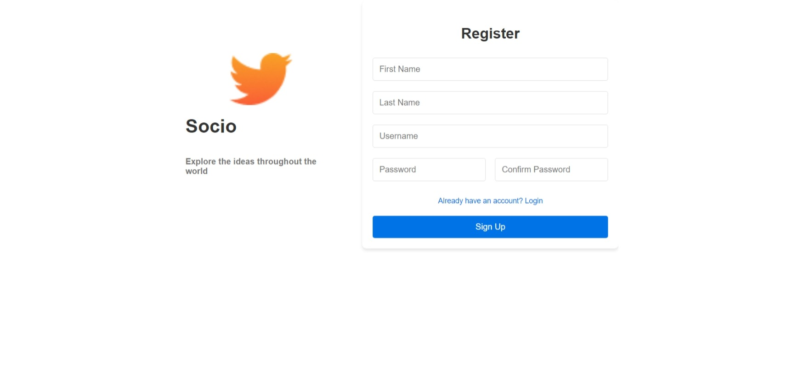
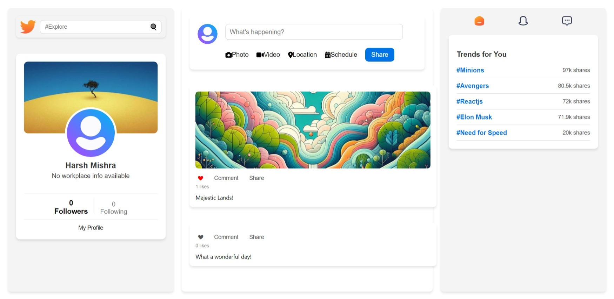
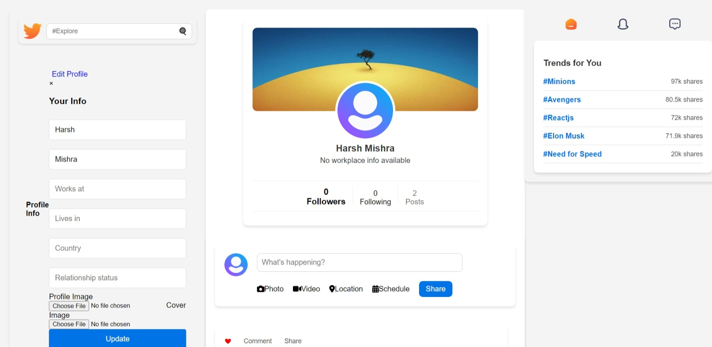

# React-Redux-MERN Social Media Application

This is a full-stack social media application built using the **MERN** stack: **MongoDB, Express.js, React, and Node.js**. The application allows users to sign up, log in, create posts, and interact with other users. The frontend uses **React** and **Redux** for state management, and the backend is powered by **Node.js** with an **Express** server. Data is stored in **MongoDB**.

## Features

-   User Authentication (Login, Register)
-   Create, Read, Update, Delete (CRUD) posts
-   Responsive UI
-   Redux for state management
-   JWT authentication for secure routes

## Technologies Used

### Frontend:

-   **React.js**: For building user interfaces.
-   **Redux**: For state management.
-   **Axios**: For handling HTTP requests.
-   **CSS**: For styling components.

### Backend:

-   **Node.js**: As the JavaScript runtime environment.
-   **Express.js**: For building RESTful APIs.
-   **MongoDB**: As the database for storing users, posts, and messages.
-   **Mongoose**: For interacting with MongoDB.
-   **JWT**: For authentication and securing routes.

## Outputs

-   **Output 1**: Register page where users can sign up for an account  
    

-   **Output 2**: Home page where users can view posts and interact with the feed  
    

-   **Output 3**: Profile page where users can view and edit their profile details  
    

## API Endpoints

Here are the core API routes for the backend:

-   **Auth**: `/auth` (Login, Register, etc.)
-   **Users**: `/users` (Get, Update user details)
-   **Posts**: `/posts` (CRUD operations for posts)
-   **Upload**: `/upload` (For image uploads)
